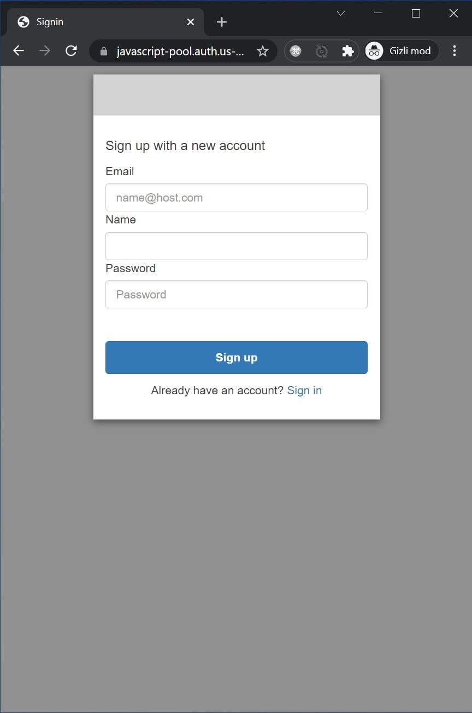
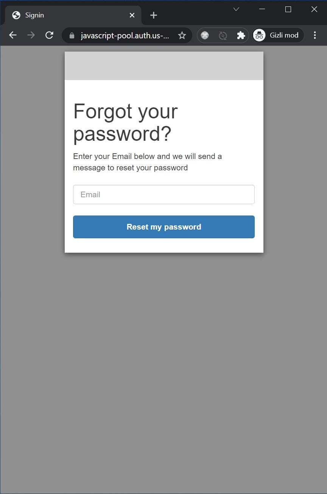
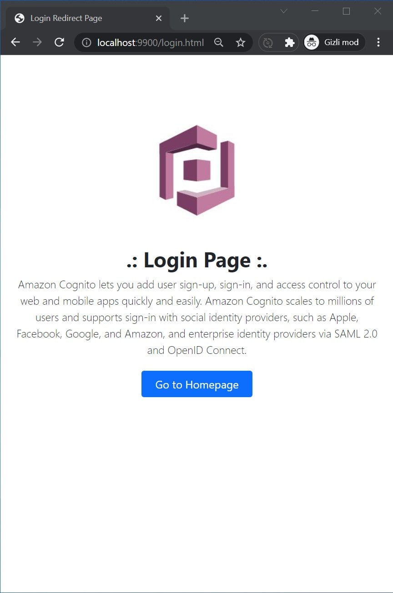

# AWS Cognito Hosted UI Javascript Sample App

- Landing page
- AWS Cognito Hosted UI

## Installation

    mkdir aws-cognito-hosted-ui-javascript-sample-app
    cd aws-cognito-hosted-ui-javascript-sample-app
    git clone git@github.com:mahmutbayri/aws-cognito-hosted-ui-javascript-sample-app.git .

    # this is only require for serving static files and replace env varible inside index.html
    npm install

    cp .env.example .env
    # edit your .env file, and difine CLIENT_ID, USERPOOL_ID, DOMAIN
    node src/replace-index-file-env-variable.js

## Test server

    PORT=9900 npm run serve
    
http://localhost:9900

## Rebuilding bundle

if you need to recreate `bundle.js` file, please run this command.

    npm run build

## Screenshots

### Landing page

### Amazon Cognito Hosted UI - Login page

### Amazon Cognito Hosted UI - Sign up page

### Amazon Cognito Hosted UI - Forgot password page

### Amazon Cognito Hosted UI - Redirect page

### Landing page with a private content

### Logout redirect page

